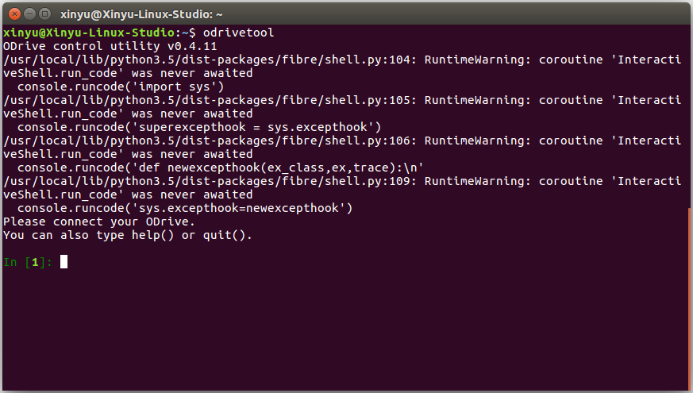
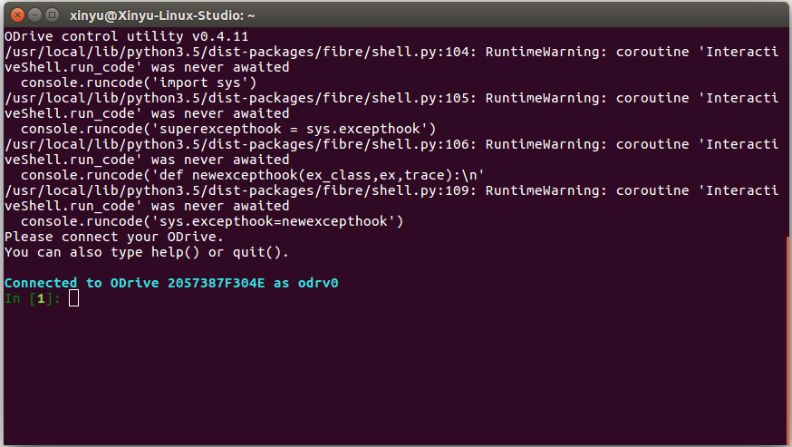

# 快速入门

- [README](../README.md)
    - [快速入门](./001_getting-started_cn.md)
        - [1 基础硬件配置](#1-基础硬件配置)
        - [2 基础硬件搭设](#2-基础硬件搭设)
        - [3 下载安装 ODrive 工具包](#3-下载安装-ODrive-工具包)
        - [4 启动 `odrivetool` 工具包](#4-启动-`odrivetool`-工具包)
        - [5 基础指令行](#5-基础指令行)
        - [6 电机的位置控制](#6-电机的位置控制)
        - [7 其他控制模式](#7-其他控制模式)
        - [8 监视时钟](#8-监视时钟)

## 1 基础硬件配置

### 1.1 元件清单
|元件|描述|数据表|数量|
|:---:|:---:|:---:|:---:|
|电源|24V||1|
|电机驱动|ODrive v3.6|[link](https://odriverobotics.com/shop/odrive-v36)|1|
|双轴电机|D5065|[link](https://odriverobotics.com/shop/odrive-custom-motor-d5065)|1|
|电机壳|NEMA 23 for D5065|[link](https://discourse.odriverobotics.com/t/nema-enclosures-for-d5065-and-d6374-motors/830)|1|
|电机壳面板|aluminium|[link](https://odriverobotics.com/shop/nema23-faceplate-for-d5065-motor)|1|
|编码器|CUI AMT102-V|[link](https://odriverobotics.com/shop/cui-amt-102)|1|
|热缩管|||3|
|紧固件 1|M3 8mm for encoder to enclosure||2|
|紧固件 2|M3 8mm for plate to enclosure||4|
|紧固件 3|M4 8mm for plate to motor||4|

### 1.2 工具清单
|工具|描述|数据表|数量|
|:---:|:---:|:---:|:---:|
|||||

## 2 基础硬件搭设

### 2.1 连接电机

### 2.2 连接编码器

### 2.3 连接电机驱动


## 3 下载安装 ODrive 工具包

### 3.1 Linux
以 Ubuntu 16.04 系统为例

1. 安装 [Python 3](https://www.python.org/downloads/)
```bash
sudo apt install python3
sudo apt install python3 python3-pip
```
2. 安装 ODrive 工具包
```bash
sudo pip3 install odrive
```
> :warning:
>
> 安装过程可能出现报错
>
> **报错信息**
> ```bash
> GET ERROR: Command "python setup.py egg_info" failed with error code 1 in /tmp/pip-build-4w6I54yu/matplotlib/
> ```
> 报错原因可能是由于当前 `setuptools` 版本过旧
>
> **解决办法**
> ```bash
> pip install --upgrade setptools
> ```
3. 查看设备管理器规则文件是否已自动更新，否则手动添加
```bash
 echo 'SUBSYSTEM=="usb", ATTR{idVendor}=="1209", ATTR{idProduct}=="0d[0-9][0-9]", MODE="0666"' | sudo tee /etc/udev/rules.d/91-odrive.rules
 sudo udevadm control --reload-rules
 sudo udevadm trigger
```
4. 在 bash 中添加 odrivetool 的路径
```bash
echo "PATH=$PATH:~/.local/bin/" >> ~/.bashrc
```

## 4 启动 `odrivetool` 工具包
---
开启新终端窗口，键入以下代码启动 ODrive 的主交互工具界面
```bash
odrivetool
```


通过 USB 线缆连接 ODrive 电机驱动至主机，等待终端返回确认已连接 ODrive 的信息
```bash
Connected to ODrive SERIAL_NUMBER as odrv0
```


## 5 基础指令行

### 5.1 查看驱动板供电电压
```
odrv0.vbus_voltage
```

### 5.2 设定参数极限

`设定类指令行 = 设定值`

**电流极限**
```
odrv0.axis0.motor.config.current_lim = 设定值（安培）
```
出于安全原因，初始默认值设定为 10 安培。该设定无法实现强劲的性能，但足以用于确认电机驱动稳定状态。当确认 ODrive 运行成功后，该值可升至 60 安培以提高性能。

当设定值高于 60A 时，需要通过修改电流范围的命令以修改电流放大器增益。

**电流范围**
```
odrv0.axis0.motor.config.requested_current_range = 设定值（安培）
```
初始默认值设定为 60 安培。

**速度极限**
```
odrv0.axis0.controller.config.vel_limit = 设定值（计数/秒）
```
初始默认值设定为 20000。

**校定电流**
```
odrv0.axis0.motor.config.calibration_current = 设定值（安培）
```
初始默认值设定为 10 安培。

### 5.3 设置其他硬件参数

`设定类命令行 = 设定值`

**制动电阻阻值**
```
odrv0.config.brake_resistance = 设定值（欧姆）
```
初始默认值设定为 0.5 欧姆。

**电机极对数**
```
odrv0.axis0.motor.config.pole_pairs = 设定值（对数）
```
初始默认值设定为 7。

**电机类型**
```
odrv0.axis0.motor.config.motor_type = 设定值
```
初始默认值设定为 MOTOR_TYPE_HIGH_CURRENT。

|电机类型|代码值|
|:---:|:---:|
|MOTOR_TYPE_HIGH_CURRENT|0|
|MOTOR_TYPE_GIMBAL|2|

**伺服器精度**
```
odrv0.axis0.encoder.config.cpr = 设定值（计数/转）
```
初始默认值设定为 8192。

### 5.4 保存参数设定

```
odrv0.save_configuration()
```

```
odrv0.reboot()
```

## 6 电机的位置控制

### 6.1 完整校准程序
```
odrv0.axis0.requested_state = AXIS_STATE_FULL_CALIBRATION_SEQUENCE
```

### 6.2 闭环控制程序
```
odrv0.axis0.requested_state = AXIS_STATE_CLOSED_LOOP_CONTROL
odrv0.axis0.controller.pos setpoint = 设定值
```

## 7 其他控制模式

默认的控制模式为基于绝对编码器返回值的不经信号滤波处理的位置控制。除此以外，ODrive 还提供以下控制模式

- [7.1 轨迹控制](#7.1-轨迹控制)
- [7.2 给定位置范围的位置控制](#7.2-给定位置范围的位置控制)
- [7.3 速度控制](#7.3-速度控制)
- [7.4 给定加速度的速度控制](#7.4-给定加速度的速度控制)
- [7.5 电流控制](#7.5-电流控制)

### 7.1 轨迹控制

当电机处于位置控制模式时，使用 `move_to_pos` 和 `move_incremental` 功能对电机进行控制。详细信息请查看 [**7.1.2 使用说明**](#7.1.2-使用说明) 部分。

该模式可以获得流畅的加速、滑行、减速的运动控制。通过纯位置控制，控制器可以实现尽可能迅速的响应速度。可以使用轨迹对闭环控制器进行调节，从而使其在保持流畅运动的同时减少震荡。

#### 7.1.1 参数设定

```bash
odrv0.axis0.trap_traj.config.vel_limit = 设定值 (计数/秒)
odrv0.axis0.trap_traj.config.accel_limit = 设定值 (计数/秒^2)
odrv0.axis0.trap_traj.config.decel_limit = 设定值 (计数/秒^2)
odrv0.axis0.trap_traj.config.A_per_css = 设定值
```
其中

`vel_limit` 是最大设计运行速度。    
`accel_limit` 是最大设计运行加速度。    
`decel_limit` 是最大设计运行减速度。    
`A_per_css` 是电机运行加速度与电机电流的相关系数。默认值为 0 。该参数为可选设定值，可用于提升系统反应性能。当系统负载改变后，该值需要进行相应调整。

#### 7.1.2 使用说明

`move_to_pos` 功能用于控制电机运行至绝对位置。
```bash
odrv0.axis0.controller.move_to_pos(设定值)
```

`move_incremental` 功能用于控制电机运行至相对位置。
```bash
from_goal_point = 设定值 (True/False)
odrv0.axis0.controller.move_incremental(设定值, from_goal_point)
```
其中，当运动相对于当前位置时，`from_goal_point` 设定值为 `False`。当运动相对于上次目标位置时，`from_goal_point` 设定值为 `True`。

### 7.2 给定位置范围的位置控制

运行以下代码以启动给定位置范围的位置控制
```
axis.controller.config.setpoints_in_cpr = True
```
该模式有助于进行连续的增量式位置运动。

### 7.3 速度控制
```bash
odrv0.axis0.controller.config.control_mode = CTRL_MODE_VELOCITY_CONTROL
odrv0.axis0.controller.vel_setpoint = 设定值 (计数/秒)
```

### 7.4 给定加速度的速度控制
```bash
odrv0.axis0.controller.config.control_mode = CTRL_MODE_VELOCITY_CONTROL
axis.controller.config.vel_ramp_rate = 设定值 (计数/秒^2)
axis.controller.vel_ramp_enable = True
odrv0.axis0.controller.vel_setpoint = 设定值 (计数/秒)
```

### 7.5 电流控制
```bash
odrv0.axis0.controller.config.control_mode = CTRL_MODE_CURRENT_CONTROL
odrv0.axis0.controller.current setpoint = 设定值 (安培)
```

## 8 监视时钟

每部电机都有一个可配置的监视时钟，可用于 ODrive 控制器连接中断时强制制动。
```bash
odrv0.axis0.config.watchdog_timeout = 设定值（秒）
```
当定值为 0 时，监视时钟功能被禁用。

当设定值为大于 0 的任意值时，电机将在监视时钟记时超时时被强制制动。

监视时钟需用到 `odrv0.axis0.watchdog_feed()` 记时。