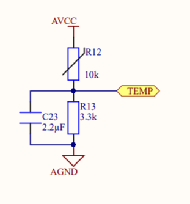
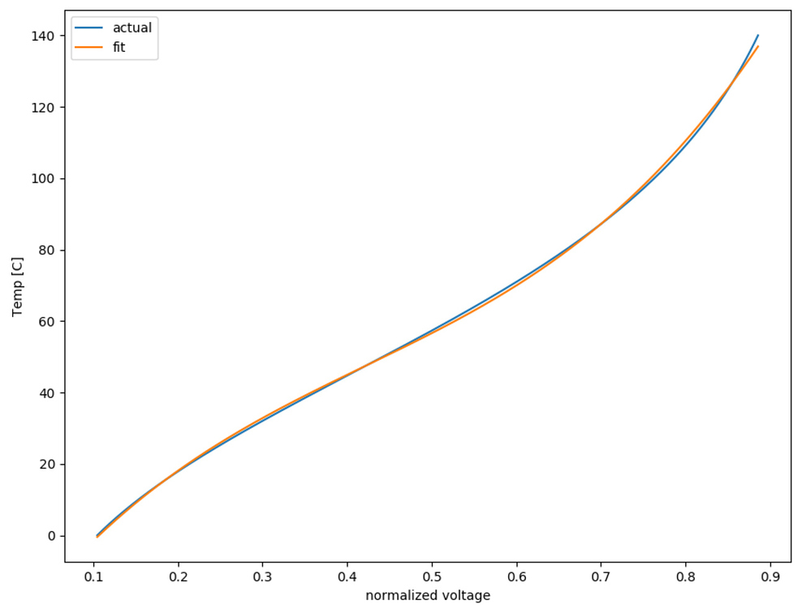

# Datasheet Base 数据文档库

- [README](../README.md)
    - [Datasheet Base 数据文档库](./102_datasheet-base.md)

## 1 Hardware

### 1.1 ODrive Board MOSFET Thermistor

NTC(Negative Temperature Coefficient) 10kOhm 3380K

> 

 What do the thermistor specifications mean ?

> 
> * **Resistance** This is the thermistor resistance at the temperature specified by the manufacturer, often 25°C.
> 
> * **Tolerance** Indicates how much the resistance can vary from the specified value. Usually expressed in percent (e.g. 1%, 10%, etc). For example, if the specified resistance at 25°C for a thermistor with 10% tolerance is 10,000 ohms then the measured resistance at that temperature can range from 9,000 ohms to 11000 ohms.
> 
> * **B (or Beta) constant** A value that represents the relationship between the resistance and temperature over a specified temperature range. For example, "3380 25/50" indicates a beta constant of 3380 over a temperature range from 25°C to 50°C.
> 
> 

[Datasheet](./datasheets/datasheet_100-01_thermistor_muRata_NCP15XH103F03RC.pdf)

[Application GUide](./datasheets/datasheet_100-02_thermistor-application-guide.pdf)

[Store](https://www.digikey.com/product-detail/en/murata-electronics-north-america/NCP15XH103F03RC/490-4801-1-ND/1644682)

[Community Reference](https://discourse.odriverobotics.com/t/thermistors-on-the-odrive/813)

The mapping in odrivetool for the thermistors are:

* M0 FETs: channel 15
* M1 FETs: channel 4
* Brake resistor FETs: channel 5

For instance, to get the voltage for the M0 thermistor in odrivetool by `odrv0.get_adc_voltage(15)`

A 3rd order polynomial fit of voltage-to-temperature equation has been obtained by Oskar Weigl. [script](https://github.com/madcowswe/ODrive/blob/devel/analysis/thermistors.py)

The coefficients from this 3rd order polynomial fit, from high to low order, are:
[ 363.0172658 -459.19773008 308.29273921 -28.12731452]

### 1.2 ODrive Motor Winding Themistor

NTC(Negative Temperature Coefficient) 10kOhm 1% 3435

### 1.3 ODrive Board Brake Resistor

50WR5J 50W 0.5Ohm

> 

 What do the resistor specifications mean ?

> 
> * **[RKM code](https://en.wikipedia.org/wiki/RKM_code)** 
> 
> 

### 1.4 ODrive Motor

|Specification|Value|
|:---:|:---:|
|Current Constant Kv|270 (rpm/v)|
|Max Current|65A|
|Max Voltage|32V|
|Weight|420g|

### 1.5 Encoder

CUI-AMT102

[Datasheet](./datasheets/datasheet_100-03_encoder_CUI-AMT102_assembly-instruction.pdf)

[Assembly Instruction](./datasheets/datasheet_100-04_encoder_CUI-AMT102_assembly-instruction.pdf)

[Store](https://www.digikey.com/product-detail/en/cui-inc/AMT102-V/102-1307-ND/827015)

|Specification|Value|
|:---:|:---:|
|Resolution|8192 (count/rev)|
|Noise|0.0127 (deg)|
|Max Speed|7500 (rpm)|
|Interfaces|Quadrature; Index;|
